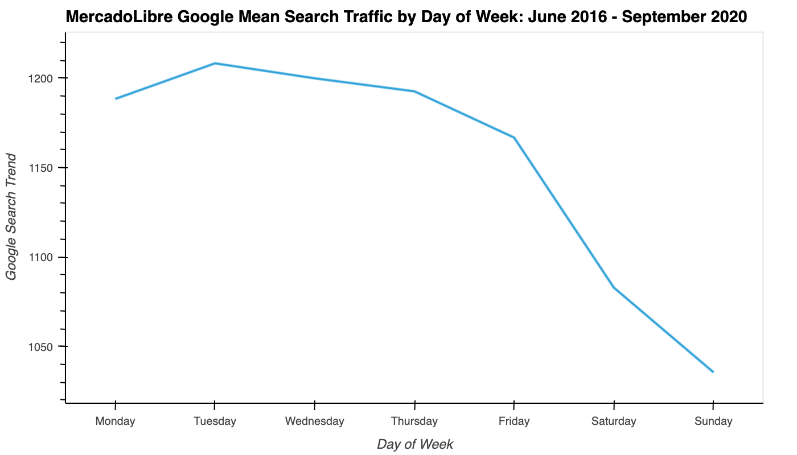
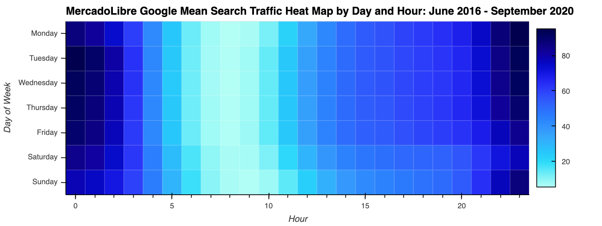
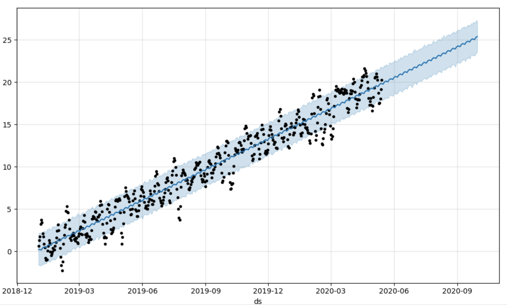

# Columbia Engineering FinTech Bootcamp 2023-06

> Project: Module 11 Time-Series Challenge

> Background: With over 200 million users, MercadoLibre is the most popular e-commerce site in Latin America.

> Purpose: In this activity, we use our newfound Python, time-series, and Prophet model skills to find out whether the ability to predict search traffic at MercadoLibre may translate into successfully trading the stock.  

## Table of Contents
* [General Info](#general-information)
* [Technologies Used](#technologies-used)
* [Features](#features)
* [Screenshots](#screenshots)
* [Setup](#setup)
* [Usage](#usage)
* [Project Status](#project-status)
* [Room for Improvement](#room-for-improvement)
* [Acknowledgements](#acknowledgements)
* [Contact](#contact)
<!-- * [License](#license) -->

## General Information
- Our project was designed to use Facebook's time-series forecasting Prophet model within Google's Colab IDE environment.

## Technologies Used
- Python Version 3.10.12
- Prophet Version 1.1.4
- Jupyter Notebook within the Google Colab IDE for purposes of compatibility with Facebook's Prophet model.

## Features

## Screenshots

MercadoLibre Google Search traffic by day of week

MercadoLibre Google Search traffic heat map by day of week and hour

Forecasted MercadoLibre quarterly revenue predicted using Facebook's Prophet model

## Setup
- GitHub Repository
    - name: 'time-series-challenge'
    - location: uploaded as https link to Bootcamp's designated homework submission online portal, and available as public repository at:
        - [GitHub Repository](https://github.com/boz-tcm/time-series-challenge.git)
- Python Standard Library Version 3.10.12
- Python Libraries and Modules:
    - !pip install pystan
    - !pip install prophet
    - !pip install hvplot
    - !pip install holoviews
    - prophet 1.1.4
    - pathlib and Path function
    - pandas
    - hvplot.pandas
    - holoviews
    - numpy
    - matplotlib
    - datetime

- Jupyter Notebook(s):
    - name: 'forecasting_net_prophet.ipynb'
    - location: 'time-series-challenge/'
- Data
    - location: 'time-series-challenge/Resources/'
- Images
    - location: 'time-series-challenge/Images'

## Usage
The script is run in the Jupyter Notebook 'forecasting_net_prophet.ipynb', within the 'time-series-challenge' directory, executed using Google's Colab IDE.

## Project Status
Project is: _complete

## Room for Improvement
Room for improvement:  _

To do:  _

## Acknowledgements

## Contact
Created by Todd C. Meier, tmeier@bozcompany.com - feel free to contact me!

<!-- ## License --> All rights reserved.

Last updated:  September 19, 2023. 